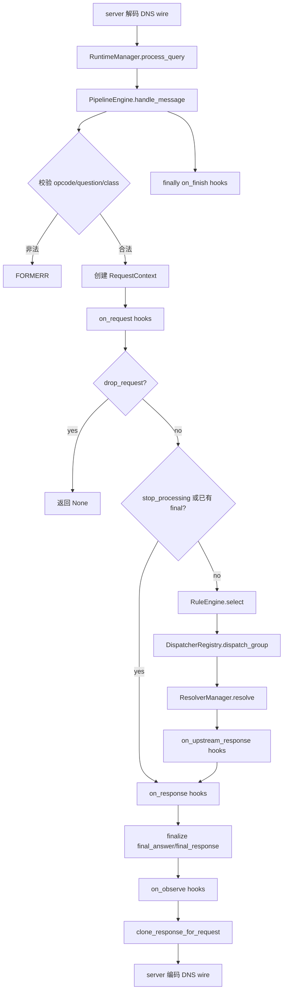
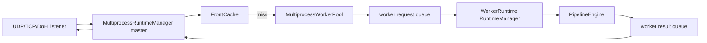

# python-smartdns 架构与重构文档

本文档基于当前源码梳理，目标是给后续重构提供稳定地图：哪些模块负责装配，DNS 请求如何流动，插件在哪些阶段介入，以及哪些边界不能随意移动。

## 1. 总览

`python-smartdns` 是一个异步 DNS 转发器。外部 UDP/TCP DNS 请求和可选 DoH 请求都会被转换成 `dns.message.Message`，交给同一个运行时入口处理。核心 DNS 对象和协议编解码由 `dnspython` 承担，配置校验由 `pydantic` / `pydantic-settings` 承担。

主要边界如下：

| 子系统 | 主要文件 | 职责 |
| --- | --- | --- |
| 入口与运行时 | `main.py`, `dns_forwarder/core/runtime.py` | CLI、配置加载、组件装配、listener/WebUI 生命周期、reload |
| 配置 | `dns_forwarder/config/models.py`, `dns_forwarder/config/loader.py` | 单一 `config.json` 模型、引用校验、插件配置校验和物化、JSON Schema |
| DNS 服务端 | `dns_forwarder/server/udp.py`, `dns_forwarder/server/tcp.py`, `dns_forwarder/server/doh.py` | 协议入口，wire 与 `dns.message.Message` 互转 |
| Pipeline | `dns_forwarder/pipeline/engine.py`, `dns_forwarder/pipeline/context.py` | 请求校验、插件 hook、规则选择、调度、响应收敛、内部解析 |
| 规则 | `dns_forwarder/rules/engine.py` | 根据 request tags 和 qtype 选择 upstream group 与 dispatcher |
| 调度 | `dns_forwarder/dispatcher/*.py` | 对 upstream group 内目标执行 `race` 或 `wait_all` |
| Resolver | `dns_forwarder/resolver/manager.py`, `dns_forwarder/resolver/upstream.py`, `dns_forwarder/resolver/nameservers/` | 将配置转换为 dnspython nameserver/resolver 并执行上游查询 |
| 插件 API | `dns_forwarder/plugin_api/*.py` | 插件模型、注册表、插件加载、hook 顺序、插件目录/catalog |
| 内置插件 | `plugins/*` | tag、cache、query log、改写、过滤、测速、ECH、HTTPS 清洗等扩展 |
| WebUI | `dns_forwarder/webui/app.py` | 配置编辑、手动 reload、query log 页面和 API，可注册 DoH route |
| 多进程 | `dns_forwarder/core/multiprocess/*.py`, `dns_forwarder/core/front_cache.py` | master/worker 查询分发、共享 tag 资源、前置缓存、跨进程内部解析 |

## 2. 启动与运行时装配

### 2.1 CLI 入口

启动链路：

```text
main.py
  -> dns_forwarder.core.runtime.main()
     -> build_parser()
     -> load_config(config_path)
     -> configure_logging()
     -> install_loop_policy()
     -> serve(config_path) 或 check-config
```

`main.py` 只是薄包装。真正入口在 `dns_forwarder/core/runtime.py`。

命令：

```bash
uv run python main.py --config config.example.json check-config
uv run python main.py --config config.example.json serve
```

### 2.2 运行时类型选择

`create_runtime_manager()` 会先读取一次配置：

```text
if config.runtime.multiprocess.resolved_workers() > 1:
    使用 MultiprocessRuntimeManager
else:
    使用 RuntimeManager
```

单进程和多进程最终都暴露相同的关键入口：

- `start()`
- `stop()`
- `reload()`
- `process_query(request, clientaddr, listener_name)`
- `get_status()`
- `get_query_log_store()`

这使 UDP/TCP/DoH listener 不需要关心后端是单进程还是多进程。

### 2.3 单进程 RuntimeManager 装配

`RuntimeManager._build_state()` 是单进程装配中心：

```text
load_config(config_path)
configure_logging(config.runtime.log_level)
PluginManager.build(config.plugins, config.runtime.plugin_dirs, shared_contexts)
ResolverManager(config, plugin_manager.registry)
DispatcherRegistry()
PipelineEngine(config, resolver_manager, dispatcher_registry, plugin_manager)
RuntimeState(...)
```

`RuntimeState` 保存一次装配后的运行态对象：

- `config`: 已校验并物化插件列表的 `AppConfig`
- `plugin_manager`: 已启用插件实例和注册表
- `resolver_manager`: 上游 resolver 与 nameserver map
- `dispatcher_registry`: `race` / `wait_all` 策略注册表
- `pipeline`: DNS 请求处理主链路

`RuntimeManager.start()` 会启动 DNS listener，并按配置启动 WebUI/DoH HTTP 服务。

`RuntimeManager.reload()` 会重新构建 `RuntimeState`。如果 listener 或 WebUI 地址发生变化，且服务已经启动，则 reload 会失败并要求重启进程。

## 3. 配置数据流

### 3.1 AppConfig 是配置边界

项目固定使用单一 `config.json`。配置根模型是 `AppConfig`：

```text
AppConfig
  runtime
  tree_root
  listeners
  nameservers
  upstreams
  groups
  rules
  plugins
  webui
```

配置对象来源由 `AppConfig.settings_customise_sources()` 定义，包含初始化参数、环境变量、dotenv、JSON 文件和 file secrets。`load_config(config_path)` 会基于传入路径生成临时 settings class，使同一个模型可以读取不同配置文件。

### 3.2 引用校验

`AppConfig.validate_references()` 会在模型构建后执行：

- listener、nameserver、upstream、group、rule、plugin 名称不能重复。
- 至少需要一个 listener，或者启用 WebUI/DoH。
- 至少需要一个 nameserver、upstream、upstream group。
- `runtime.default_upstream_group` 必须存在。
- upstream 引用的 nameserver 必须存在。
- group 可以引用 upstream 或 group，但 group 名称不能与 upstream 名称冲突。
- group 嵌套不能形成循环。
- rule action 引用的 upstream group 必须存在。

### 3.3 配置到运行对象

配置对象不是直接处理 DNS 的对象。运行时会做几层转换：

```text
config.nameservers
  -> resolver.nameservers.build_nameserver_map()
  -> dict[name, dns.nameserver.Nameserver]

config.upstreams
  -> ResolverManager._build_resolver()
  -> UpstreamResolver(dns.asyncresolver.Resolver)

config.groups
  -> ResolverManager._groups

config.rules
  -> RuleEngine

config.plugins
  -> PluginManager.loaded_plugins + PluginRegistry
```

`load_config()` 还会调用插件 catalog：

```text
validate_plugin_configs(config.plugins, config.runtime.plugin_dirs)
materialize_plugin_configs(config.plugins, config.runtime.plugin_dirs)
```

因此加载后的 `config.plugins` 会包含所有已知插件；未显式配置的插件会被补成默认配置且 `enabled=False`。WebUI 保存配置和生成 JSON Schema 也依赖这套物化逻辑。

## 4. DNS 请求主流程

### 4.1 入口协议到 Pipeline

UDP、TCP、DoH 入口只负责协议适配：

```text
UDP datagram / TCP framed payload / DoH body
  -> dns.message.from_wire()
  -> runtime_manager.process_query(request, clientaddr, listener_name)
  -> PipelineEngine.handle_message()
  -> dns.message.Message | None
  -> response.to_wire()
```

当 pipeline 返回 `None` 时：

- UDP/TCP：丢弃，不发送响应。
- DoH：转换成 `REFUSED` 响应，因为 HTTP 请求需要明确响应体。

### 4.2 Pipeline 阶段图



### 4.3 请求校验

`PipelineEngine._validate_request_or_error()` 当前只接受：

- DNS opcode 为 `QUERY`
- `question` 数量恰好为 1
- qclass 为 `IN`

不满足时返回 `FORMERR`。

### 4.4 RequestContext

每个请求都会创建一个 `RequestContext`，它是 pipeline 和插件之间的核心数据契约：

| 字段 | 含义 |
| --- | --- |
| `request` | 原始 `dns.message.Message` |
| `clientaddr` | listener 传入的客户端地址 |
| `listener_name` | listener 名称，DoH 默认是 `doh` |
| `request_id` | 使用 DNS message id |
| `selected_rule` | 命中的 rule 名称 |
| `selected_group` | 实际选择的 upstream group |
| `selected_dispatcher` | 实际使用的 dispatcher 名称 |
| `final_answer` | 最终 `dns.resolver.Answer` |
| `final_response` | 最终 `dns.message.Message` |
| `drop_request` | 为 true 时 pipeline 返回 `None` |
| `stop_processing` | 用于短路后续处理 |
| `metadata` | 临时元数据，主要供日志、插件协作和测试观察 |
| `tags` | 请求级标签，规则选择主要依赖它 |
| `extensions` | 插件注册的上下文对象，每个请求构建一次 |
| `answer_registry_refs` | answer builder 快照 |
| `upstream_results` | 已选调度结果列表 |

重构时要保持 `RequestContext` 轻量。插件私有状态优先放在 `extensions` 中，并通过 `register_context_factory()` 创建插件本地上下文，不要把插件专用字段直接加到 `RequestContext`。

### 4.5 request 阶段

`PluginManager.on_request()` 按 `request_order` 从小到大执行启用插件：

```text
for plugin in ordered(request_order):
    context.metadata["plugin_order"].append(plugin.name)
    await plugin.on_request(context)
    if context.drop_request or context.stop_processing:
        break
```

request 阶段后的行为：

- `drop_request=True`：直接返回 `None`，不会进入响应阶段。
- `stop_processing=True`：不再 dispatch，也不会执行 response hooks，但会 finalize、observe、finish。
- 已设置 `final_answer` 或 `final_response`：跳过 dispatch，但仍可进入 response hooks，除非同时设置了 `stop_processing`。
- 都没有设置：进入规则选择和上游调度。

### 4.6 规则选择

`RuleEngine.select(context)` 使用当前 request tags 和 qtype：

```text
for enabled rule in config.rules:
    exclude_tags 命中 -> 不匹配
    match_tags 非空且未命中 -> 不匹配
    qtypes 非空且当前 qtype 不在列表 -> 不匹配
    返回 rule.action.upstream_group / dispatcher

无匹配 -> runtime.default_upstream_group
```

注意：规则选择只看到 request 阶段已经写入的 `context.tags`。`on_upstream_response` 阶段产生的结果标签不会反过来影响当前请求的 rule 选择。

### 4.7 调度与上游解析

`PipelineEngine._dispatch_context()` 会把 rule selection 转成实际调度：

```text
selected_group = selection.upstream_group
selected_dispatcher = selection.dispatcher or runtime.default_upstream_policy
group = resolver_manager.get_group(selected_group)
dispatcher_registry.dispatch_group(context, group, selected_dispatcher, resolver_manager)
```

`DispatcherRegistry.dispatch_target()` 支持两种 target：

- target 是 group：递归调度该 group。
- target 是 upstream：调用 `ResolverManager.resolve(upstream_name, context)`。

上游解析顺序：

```text
ResolverManager.resolve()
  -> 如果 plugin_registry.resolver_registry[upstream_name] 存在，使用插件 resolver
  -> 否则使用配置构建的 UpstreamResolver
```

`UpstreamResolver` 内部使用 `dns.asyncresolver.Resolver`，根据 `UpstreamConfig` 设置 timeout、lifetime、TCP、ECS、nameservers 等。

当前 dispatcher：

| 策略 | 行为 |
| --- | --- |
| `race` | 并发请求 group 内所有 target，返回第一个成功结果，随后取消未完成任务；全部失败时优先返回 NXDOMAIN，再返回首个其他错误 |
| `wait_all` | 等待全部 target 完成，成功时返回最快成功结果，并把所有结果写入 `collected_results`；全部失败时同样优先 NXDOMAIN |

每个完成的 upstream target result 会触发 `on_upstream_response(context, result)`。pipeline 会等待这些 hook task 完成后再使用最终 result。

### 4.8 response、observe、finish

`on_response()` 按 `response_order` 从小到大执行。某个 response hook 设置 `drop_request` 或 `stop_processing` 后，后续 response hook 不再执行。

`_finalize_context()` 负责让 `final_answer` 和 `final_response` 收敛：

- 只有 `final_response`：从 response 构建 answer。
- 只有 `final_answer`：同步 answer 的 rrset 到 response，然后 clone response。
- 两者都没有：生成 `SERVFAIL`。
- 两者都有：以 `final_answer` 为准同步 response。

响应对象返回给 server 前会通过 `clone_response_for_request()` 克隆，并把 response id 设置成原请求 id。

`on_observe()` 在 finalize 后执行，适合记录日志、指标、审计数据。observe 抛异常只会记录日志，不改变最终响应。

`on_finish()` 在 `finally` 中执行。它用于清理或兜底完成 pending 状态，例如 cache 插件确保并发等待者一定被唤醒。`on_finish()` 当前按启用插件的配置顺序执行，而不是按 order 字段排序；每个插件的 finish 异常会被单独捕获并记录。

### 4.9 内部解析 context.resolve()

插件可以调用：

```python
answer = await context.resolve(qname, qtype)
```

当前行为：

- qname 会 trim、去末尾点、转小写。
- qtype 会 trim、转大写。
- 使用 `_nested_resolve_chain` 检测递归。
- 最大嵌套深度是 `PipelineEngine.MAX_NESTED_RESOLVE_DEPTH = 8`。
- 单进程内部解析创建 nested `RequestContext`，复用同一份 `extensions` 和 `answer_registry_refs`。
- 内部解析只走规则选择、dispatcher、resolver，不走 request/response/observe 插件 hook。
- 多进程 worker 内部解析会通过 IPC 请求 master，由 master 执行 `resolve_nested_query()` 后把 DNS wire 或错误传回 worker。

这个设计避免插件内部解析再次触发插件 hook 链，降低递归和副作用风险。

## 5. 主要数据流

### 5.1 DNS 数据

```text
wire bytes
  -> dns.message.Message request
  -> RequestContext.request
  -> dns.resolver.Answer 或 dns.message.Message
  -> RequestContext.final_answer / final_response
  -> clone_response_for_request()
  -> wire bytes
```

重构 DNS 响应改写时优先使用现有 helper：

- `build_answer_from_response(request, response)`
- `sync_answer_rrset_to_response(answer)`
- `sync_answer_response(answer)`
- `clone_response_for_request(response, request)`
- `make_error_response(request, rcode)`

不要直接在多处手工拼接 response id、rrset 同步和 wire clone 逻辑。

### 5.2 标签数据

标签分两类：

- `context.tags`: 请求级标签，影响 rule selection，也供后续插件使用。
- `UpstreamResult.tags`: 某个上游结果的标签，影响响应阶段的过滤、改写、测速、ECH 等插件。

典型流向：

```text
tag_plugin.on_request()
  -> 根据 qname 查询 DomainSet
  -> context.tags
  -> RuleEngine.select()
  -> Dispatcher/Resolver
  -> tag_plugin.on_upstream_response()
     -> result.tags = context.tags + CNAME/domain/IP/HTTPS hint 命中的标签
  -> response plugins 使用 context.tags 或最后一个 UpstreamResult.tags
```

`wait_all` 会把所有上游结果保存在最终 result 的 `collected_results` 中。测速插件会利用这些结果收集候选 IP。

### 5.3 插件上下文数据

插件注册表会在每个请求创建 `RequestContext.extensions`：

```text
PluginRegistry.context_registry
  -> PluginManager.build_context_extensions()
  -> RequestContext.extensions
```

注册方式有两种：

| 注册方式 | 生命周期 | 用途 |
| --- | --- | --- |
| `register_context(name, value)` | 共享单例 | cache service、query log store、核心 DomainSet/IPSet |
| `register_context_factory(name, factory)` | 每个请求创建 | cache.context、speedtest.context 等请求私有状态 |

插件应通过清晰的 key 和类型检查读取扩展对象，例如：

```python
cache_context = context.extensions[CACHE_CONTEXT_KEY]
if not isinstance(cache_context, CachePluginContext):
    raise TypeError("cache.context 类型不正确")
```

### 5.4 DomainSet/IPSet

`tree_root.domain_dir` 和 `tree_root.ip_dir` 指向 tag 文件目录。

`load_tag_files()` 读取目录下非隐藏文件：

- 文件名 stem 是 tag。
- 空行和 `#` 注释行忽略。
- 每行经 normalizer 转换后写入 tag map。

`DomainSet`：

- 使用 `marisa_trie.BytesTrie`。
- 域名 normalize 后反转，例如 `www.example.com` 存成 `com.example.www.`。
- `lookup(qname)` 用前缀匹配返回所有覆盖标签。
- 多进程下可保存成 mmap 文件给 worker 读取。

`IPSet`：

- 使用 radix tree。
- 网络 normalize 成 CIDR。
- `lookup(address)` 返回覆盖该 IP 的所有标签。
- 多进程下通过 pickle payload 写入 shared memory。

## 6. 插件结构

### 6.1 当前插件加载方式

插件配置模型里有 `runtime.plugin_dirs`，项目约定也说插件来自本地 `plugins/` 目录。但当前代码的实际加载是静态插件列表：

```text
dns_forwarder/plugin_api/static_plugins.py
  STATIC_PLUGIN_MODULE_NAMES
  _load_all_static_plugin_modules()
  load_static_plugin_module(module_name)
```

`PluginManager._load_module(module_name, plugin_dirs)` 当前忽略 `plugin_dirs`，只从静态列表加载。

因此后续如果要改成真正的目录动态加载，必须同时调整：

- `static_plugins.py`
- `PluginManager._load_module()`
- `discover_available_plugins()`
- `validate_plugin_configs()`
- `materialize_plugin_configs()`
- WebUI 的插件 JSON Schema 和默认配置生成
- 相关测试

### 6.2 插件类契约

插件模块必须导出 `plugin` 实例，实例类型必须是 `Plugin`：

```python
class MyPlugin(Plugin):
    name = "my-plugin"
    config_model = MyPluginConfig
    variables_model = EmptyModel
    request_order = 0
    upstream_response_order = 0
    response_order = 0
    observe_order = 0

    async def setup(self, registry: PluginRegistry) -> None:
        ...

    async def on_request(self, context: RequestContext) -> None:
        ...

plugin = MyPlugin()
```

加载时不会直接复用模块里的 `plugin` 单例，而是用它的类型创建新实例：

```text
template = module.plugin
instance = type(template)()
config = instance.config_model.model_validate(plugin_config.config)
variables = instance.variables_model.model_validate(plugin_config.variables)
instance.bind(config, variables)
await instance.setup(registry)
```

因此插件的运行态初始化应该放在 `__init__()` 或 `setup()` 中，不要依赖模块级 `plugin` 实例本身保存的可变状态。

### 6.3 config 与 variables

每个插件配置由 `PluginConfig` 包裹：

```json
{
  "name": "cache",
  "module": "cache_plugin",
  "enabled": true,
  "config": {},
  "variables": {}
}
```

`config` 和 `variables` 分别由插件声明的 pydantic model 校验：

- `runtime_config`: 经 `config_model` 校验的配置。
- `runtime_variables`: 经 `variables_model` 校验的变量。

当前内置插件大多把稳定行为参数放在 `config`，示例插件用 `variables` 表示运行时可变的静态答案参数。

### 6.4 PluginRegistry 三类注册表

`PluginRegistry` 有三类注册表，职责不能混用：

| 注册表 | API | 用途 |
| --- | --- | --- |
| `context_registry` | `register_context()`, `register_context_factory()` | 向 `RequestContext.extensions` 注入共享服务或请求私有上下文 |
| `resolver_registry` | `register_resolver()` | 让插件提供一个可被 upstream name 命中的 resolver |
| `answer_registry` | `register_answer()` | 注册 answer builder，供插件通过 `context.answer_registry_refs` 构造响应 |

注册名重复会抛 `ValueError`。重构插件系统时应保留这个快速失败行为。

### 6.5 Hook 顺序

| 阶段 | 排序字段 | 是否短路 | 典型用途 |
| --- | --- | --- | --- |
| `setup` | 配置顺序 | 不适用 | 注册上下文、resolver、answer builder |
| `on_request` | `request_order` | `drop_request` 或 `stop_processing` 后停止后续 request hook | 打标签、缓存命中、静态响应、重定向 |
| `on_upstream_response` | `upstream_response_order` | 不短路 | 给单个 upstream result 打标签、过滤、改写、测速收集 |
| `on_response` | `response_order` | `drop_request` 或 `stop_processing` 后停止后续 response hook | 最终响应改写、缓存写入 |
| `on_observe` | `observe_order` | 不短路 | 日志、指标、审计 |
| `on_finish` | 启用插件配置顺序 | 每插件异常隔离 | 清理、pending 兜底完成 |

内置插件之间的顺序依赖较明显，改 order 时必须跑相关集成测试。

### 6.6 内置插件职责

| 插件 | 主要阶段 | 关键状态 | 职责 |
| --- | --- | --- | --- |
| `tag_plugin` | request `-100`, upstream_response `0` | 核心 `DomainSet` / `IPSet` | request 阶段按 qname 加 `context.tags`；上游响应阶段按 CNAME、canonical name、A/AAAA IP、HTTPS hints 加 `result.tags`，HTTPS hints 存在时加 `has_hint` |
| `block_plugin` | request `-50`, response `900` | 无 | 按 tags 返回静态 A/AAAA 或空 NOERROR，并设置 `stop_processing` |
| `redirect_plugin` | request `50` | `context.resolve()` | 按域名映射发起内部子查询，返回源域名 CNAME 加目标结果 |
| `cache_plugin` | request `0`, response `1000`, finish | `cache.service`, `cache.context` | request 阶段查缓存和合并并发相同请求；response 阶段写入 NOERROR 缓存；finish 兜底唤醒等待者 |
| `query_log_plugin` | observe `0` | `query_log.store` | finalize 后记录外部查询摘要，WebUI 读取 store 并通过 SSE 推送 |
| `ip_filter_plugin` | upstream_response `50` | 核心 `IPSet` | 按 request tags 和 IPSet tags 过滤 A/AAAA 结果中的地址 |
| `ip_replace_plugin` | upstream_response `100`, response `500` | `IpReplaceService` | 按 result tags 对 A/AAAA 地址做 CIDR 前缀替换 |
| `speedtest_plugin` | upstream_response `200`, response `600` | `speedtest.service`, `speedtest.context` | 收集候选 IP，执行 ping/TCP 测速，按 RTT 选择最终 A/AAAA 地址；支持 fallback |
| `cloudflare_ech_plugin` | response `700` | 核心 `IPSet`, `context.resolve()` | 对 HTTPS 响应按标签注入 Cloudflare ECH 参数，必要时对子查询 A 记录判定标签 |
| `https_plugin` | response `800` | 无 | 清洗 HTTPS 记录中的 h3 ALPN 与 IPv4/IPv6 hints |
| `sample_plugin` | request `0` | answer registry 示例 | 演示注册 context/resolver/answer builder，并返回静态 A 记录 |

## 7. 多进程架构

多进程模式启用条件是 `runtime.multiprocess.resolved_workers() > 1`。

### 7.1 master/worker 分工



master 负责：

- listener 和 WebUI 生命周期。
- `FrontCache` 前置缓存。
- worker pool 启停和监督重启。
- IPC result reader 线程。
- query log 聚合。
- worker 内部解析请求的代理处理。
- reload 时构建新资源和新 worker pool，再替换旧 pool。

worker 负责：

- 启动自己的 `RuntimeManager`，但不启动 listener/WebUI。
- 从 request queue 收取 DNS wire。
- 执行 `manager.process_query()`。
- 把 response wire 或错误写回 result queue。
- 通过 `WorkerNestedResolver` 把 `context.resolve()` 请求转发给 master。

### 7.2 共享资源

`SharedTreeResources.build()` 在 master 中构建：

- `DomainSet` 保存为 marisa mmap 文件。
- `IPSet` pickle payload 写入 `multiprocessing.shared_memory.SharedMemory`。
- 临时目录记录在 `SharedTreeResources.temp_dir`。

worker 启动时通过 `shared_contexts` 注入：

```text
core.domainset -> DomainSet.from_snapshot(domain_snapshot)
core.ipset -> IPSet.from_snapshot(ip_snapshot)
query_log.store -> WorkerQueryLogStore (仅 query_log_plugin 启用时)
```

这保证 tag 文件相关结构不用每个请求重复构建，也避免 worker 直接持有 master 的 Python 对象。

### 7.3 FrontCache

多进程 master 侧有 `FrontCache`：

- key 是 `(qname, rdtype, rdclass)`。
- 只缓存 `NOERROR` 且有 rrset 的 response。
- 命中时 clone response 并按剩余 expiration 重写 TTL。
- 对相同 key 的并发请求做 pending 合并，减少重复进入 worker。

这层缓存不同于 `cache_plugin`：

- `FrontCache` 只存在多进程 master。
- `cache_plugin` 是普通插件，单进程和 worker 内都可以启用。

### 7.4 多进程内部解析

worker 内插件调用 `context.resolve()` 时：

```text
WorkerNestedResolver.resolve()
  -> 生成 resolve_id
  -> result_queue 发送 MSG_RESOLVE_REQUEST
  -> master MultiprocessWorkerPool._handle_resolve_request()
  -> MultiprocessRuntimeManager.resolve_nested_query()
  -> master RuntimeState.pipeline.resolve_nested_query()
  -> 规则选择 + 调度 + resolver
  -> MSG_RESOLVE_RESPONSE 回 worker request_queue
```

返回时 worker 用 response wire 构造 `dns.resolver.Answer`。

## 8. WebUI 与 DoH

`create_webui_app(runtime_manager)` 根据配置注册路由。

WebUI 启用时：

- `/`: 状态页。
- `/config`: JSONEditor 配置编辑页。
- `POST /config`: 校验并保存配置文件，但不自动 reload。
- `POST /admin/reload`: 手动 reload。
- `/queries`: 查询日志页面。
- `/api/query-logs`: 最近查询日志 JSON。
- `/api/query-logs/stream`: 查询日志 SSE。

DoH 启用时：

- `GET /dns-query?dns=...`
- `POST /dns-query`

DoH route 和 WebUI 共用同一个 FastAPI app，但 DoH 请求最终仍进入 `runtime_manager.process_query()`。

## 9. 重构重点和风险点

### 9.1 处理链路不变量

重构 pipeline 时应保持：

- listener 只做协议适配，不内嵌规则、插件或 resolver 逻辑。
- `PipelineEngine` 是 request hook、rule、dispatch、response hook、observe、finish 的编排中心。
- `RequestContext` 是跨插件协作的核心契约，但插件私有状态应留在 `extensions`。
- `final_answer` 与 `final_response` 必须通过现有 helper 同步，避免 answer.rrset 和 response.answer 不一致。
- 返回给客户端前必须 clone response 并保留原 request id。
- `drop_request` 和 `stop_processing` 的短路语义要有测试覆盖。

### 9.2 插件边界

插件相关重构必须同时考虑三类注册表：

- `context_registry`
- `resolver_registry`
- `answer_registry`

常见风险：

- 新增插件状态时直接改 `RequestContext`，导致核心上下文膨胀。
- 修改 hook order 破坏 tag -> rule -> result tags -> response mutation 的顺序。
- 动态加载插件时只改 loader，忘记 catalog、schema、materialize、WebUI。
- 共享单例和请求私有 context 混用，导致并发请求互相污染。

### 9.3 响应改写风险

会改写 answer/response 的插件包括：

- `block_plugin`
- `redirect_plugin`
- `cache_plugin`
- `ip_filter_plugin`
- `ip_replace_plugin`
- `speedtest_plugin`
- `cloudflare_ech_plugin`
- `https_plugin`
- `sample_plugin`

改写时需要注意：

- `dns.resolver.Answer.rrset` 和 `answer.response.answer` 可能不同步。
- 修改 rrset 后应调用 `sync_answer_rrset_to_response()` 或 `sync_answer_response()`。
- 从 response 构建 answer 时使用 `build_answer_from_response()`。
- response id 最终由 `clone_response_for_request()` 统一修正。
- NXDOMAIN 由 pipeline 在 dispatch 后转换成 error response。

### 9.4 多进程风险

多进程重构要同时验证：

- master listener/WebUI 不变。
- worker 不启动 listener/WebUI。
- query log 在 worker 内写入 `WorkerQueryLogStore` 后能回传 master。
- `context.resolve()` 能跨进程返回结果和错误。
- worker pool 损坏后能重启并清理 pending。
- reload 失败时新资源和新 worker pool 要被清理。
- service signature 变化仍要求进程重启。

### 9.5 建议测试范围

改动不同区域时优先跑：

| 改动区域 | 建议测试 |
| --- | --- |
| 配置模型/loader | `tests/test_config.py`, `main.py --config config.example.json check-config` |
| pipeline/context | `tests/test_pipeline_context.py`, `tests/test_udp_tcp_integration.py` |
| 规则/调度/resolver | `tests/test_rules.py`, `tests/test_dispatcher.py`, `tests/test_resolver_manager.py` |
| 插件 API/order | `tests/test_plugin_order.py`, `tests/test_sample_plugin.py` |
| cache/query log/speedtest 等插件 | 对应 `tests/test_*_plugin.py` |
| WebUI/DoH | `tests/test_runtime_and_webui.py`, `tests/test_doh_server.py` |
| 多进程 | `tests/test_multiprocess.py` |

完整回归：

```bash
uv run --group dev pytest -q
uv run python main.py --config config.example.json check-config
```

## 10. 快速定位清单

需要理解或修改某类行为时，从这些文件进入：

| 目标 | 入口文件 |
| --- | --- |
| 服务如何启动 | `dns_forwarder/core/runtime.py` |
| 多进程如何接管运行时 | `dns_forwarder/core/multiprocess/manager.py` |
| DNS 请求每一步怎么走 | `dns_forwarder/pipeline/engine.py` |
| 请求上下文字段和响应 helper | `dns_forwarder/pipeline/context.py` |
| 配置字段和引用校验 | `dns_forwarder/config/models.py` |
| 配置读写和插件 schema | `dns_forwarder/config/loader.py` |
| 插件生命周期和 hook | `dns_forwarder/plugin_api/base.py` |
| 插件 catalog 和默认配置 | `dns_forwarder/plugin_api/catalog.py` |
| 当前内置插件列表 | `dns_forwarder/plugin_api/static_plugins.py` |
| 上游选择规则 | `dns_forwarder/rules/engine.py` |
| dispatcher 策略 | `dns_forwarder/dispatcher/race.py`, `dns_forwarder/dispatcher/wait_all.py` |
| 上游 resolver 装配 | `dns_forwarder/resolver/manager.py`, `dns_forwarder/resolver/upstream.py` |
| nameserver 协议实现 | `dns_forwarder/resolver/nameservers/` |
| UDP/TCP/DoH 协议入口 | `dns_forwarder/server/` |
| WebUI 和配置编辑 | `dns_forwarder/webui/app.py` |
| tag 文件加载 | `dns_forwarder/core/tag_files.py`, `dns_forwarder/core/domainset.py`, `dns_forwarder/core/ipset.py` |

## 11. 当前实现与项目约定的差异

需要特别留意一处差异：项目约定写的是“插件从本地 `plugins/` 目录加载”，但当前实现实际使用 `STATIC_PLUGIN_MODULE_NAMES` 静态列表，并没有按 `runtime.plugin_dirs` 动态扫描任意插件目录。

这不是文档假设，而是当前代码事实。后续如果重构插件加载，应先决定是继续保持静态内置插件模式，还是实现真正的目录加载；不要只改配置模型或 README。
